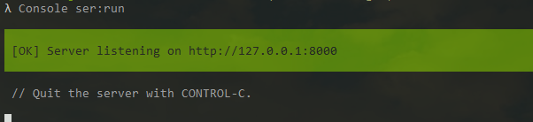

## Projet en cours

# Présentation du projet
Un Blog d'articles qui contient :
 - une page d'accueil,
 - une page d'articles, avec la liste des articles décris par une photo
 - une page article, avec un article détaillé,
 - une page d'ajout d'un article ** A ajouter accès qu'aux utilisateurs connectés**
 - une page de d'inscription
 - une page de connexion, avec fonctionnailité d'authentification et de déconnexion

### Prochaine étape
**créer un formulaire d'ajout de commentaire pour les utilisateurs connectés**


# Aux futurs employeurs voici mon projet en cours

Blog d'articles avec de fausses données en symfony 4

1. Pour le cloner tapez dans votre terminal la commande suivante : 

   **if ($cleSSH) {echo "tapez cette commande"}**
``` git clone git@github.com:Celine-Nova/SymfoBlog.git ```
   
   **else {Tapez celle-ci}**
``` https://github.com/Celine-Nova/SymfoBlog.git ```
    

2. Installez composer :
``` composer install ```

3. Créez la BDD :
``` php bin/console doctrine:database:create ```

4. Importez la :
```  php bin/console doctrine:migrations:migrate ```

5. Chargez les fixtures :
```  php bin/console doctrine:fixtures:load ```

6. Demarrez le serveur :
``` php bin/console server:run ```

7. Appuyez sur la touche **Ctrl** puis cliquez sur l'adresse du serveur 

<span class="text-info">Naviguez sur  SimBLog</span>


NB: ce projet est en cours d'amelioration

- ~~Formulaire creation article~~
- ~~Pouvoir telecharger les images~~
- ~~Formulaire modification article~~
- ~~Créer une session utilisateur, formulaire inscritption, sécurité~~
- Pouvoir ajouter des commentaires pour les utilisateus connectés, les afficher par ordre